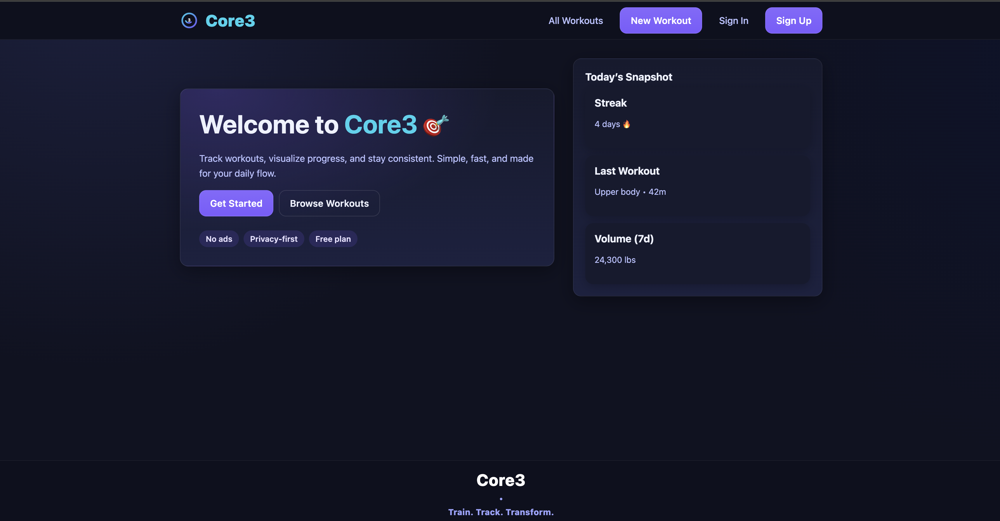

# Core3-Fitness-Tracker-App-Front-End
# 🏋️‍♀️🚴🏾‍♂️🏃🏽‍♂️ Core3 • Train. Track. Transform.

Core3 is a full-stack fitness tracker built with the **MERN stack** (MongoDB, Express, React, Node).  
It helps users sign up, log in, and manage their workouts — all while staying secure with JWT-based authentication.

  

---

## 🚀 Features
- **User Authentication**: Sign up, sign in, sign out with JWT tokens.
- **Protected Routes**: Only signed-in users can create, edit, or delete workouts.
- **Workout CRUD**: Add, view, update, and delete workouts linked to your account.
- **Dashboard**: Personalized stats and recent activity.
- **Modern UI**: Custom CSS theme with dark mode, gradients, cards, and responsive layout.

---

## 🛠️ Technologies Used
- **Front end**: React, Vite, React Router, custom CSS (Flexbox + Grid)
- **Back end**: Node.js, Express.js, MongoDB, Mongoose
- **Auth**: JWT (jsonwebtoken), bcrypt for password hashing
- **Other**: dotenv, cors, nodemon
- **Deployment**: Vercel (front end), Render/Heroku (back end)

---

## 📦 Getting Started

https://trello.com/b/oBjZy9fg

---
🙌 Attributions

Heroicons
 for icons

Google Fonts Inter

Vercel
 / Render
 hosting
---

🌍 Deployed App

Frontend (Vercel/Netlify): https://core3-frontend.vercel.app

Backend (Render/Heroku): https://core3-backend.onrender.com

---
🧩 Next Steps

Add exercise details to workouts (sets, reps, weight).

Add youtube videos that show you how to use machines and complete the exercise.

Add nutrition/food logging (future stretch).

Mobile Progressive Web App support.